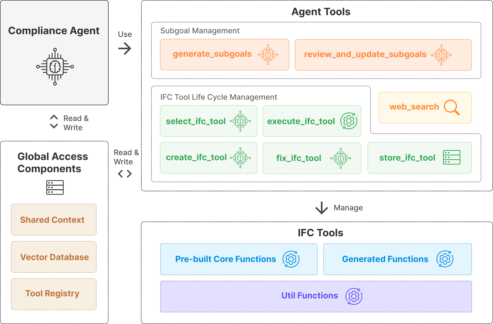

# AdaptiveACC

Adaptive agent framework for automated building code compliance checking.

## Overview
AdaptiveACC is a research prototype combining AI agents and BIM data to automate building code compliance checking. 
The system interprets regulations, extracts IFC model data, and orchestrates tools for compliance verification. 
It demonstrates the potential of integrating large language models with BIM for intelligent, semi-autonomous design validation.

## Key Features
- LLM-powered agent orchestrating multiple compliance tools.
- Self-evolving 2-tier tool ecosystem with RAG, sandbox testing, and error repair.
- IFC model parsing using IfcOpenShell for geometry and property extraction.
- FastAPI backend with ChromaDB vector store and Phoenix Tracing for debugging.
- Interactive 3D visualization in browser using Three.js.
- Scalable architecture designed for both project-scale and city-scale models.

## Tech Stack
- **AdaptiveACC:** Python · FastAPI · OpenAI · IfcOpenShell · ChromaDB · Phoenix Tracing · Pydantic · Three.js
- **Urban Digital Twin:** Node.js · Express · MongoDB · Vue.js · Three.js · FME · Google Cloud

## Demo / Screenshots

