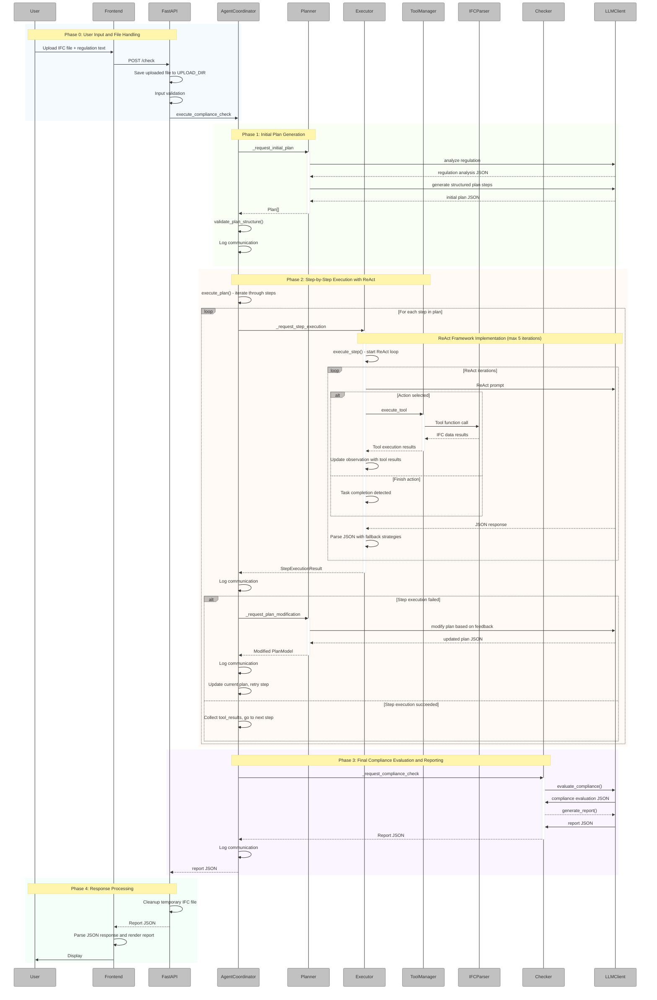

```mermaid
%%{init: {"theme":"base", "themeVariables": {"primaryColor":"#66666667", "primaryTextColor":"#333333", "primaryBorderColor":"#666666", "lineColor":"#666666", "sectionBkgColor":"#ffffff", "altSectionBkgColor":"#f8f8f8", "gridColor":"#e0e0e0", "activationBkgColor":"#ffffff", "activationBorderColor":"#dddddd"}, "sequence": {"messageFontSize": "30px", "actorFontSize": "30px"}}}%%

sequenceDiagram
    participant U as User
    participant F as Frontend
    participant API as FastAPI
    participant C as AgentCoordinator
    participant P as Planner 
    participant E as Executor
    participant TM as ToolManager
    participant IFC as IFCParser
    participant CH as Checker
    participant LLM as LLMClient

    rect rgb(245, 250, 255)
        Note over U, API: Phase 0: User Input and File Handling
        U->>F: Upload IFC file + regulation text
        F->>API: POST /check 
        API->>API: Save uploaded file to UPLOAD_DIR
        API->>API: Input validation
        API->>C: execute_compliance_check
    end

    rect rgb(250, 255, 245)  
        Note over C, P: Phase 1: Initial Plan Generation
        
        C->>P: _request_initial_plan
        activate P
        P->>LLM: analyze regulation
        LLM-->>P: regulation analysis JSON
        P->>LLM: generate structured plan steps
        LLM-->>P: initial plan JSON
        P-->>C: Plan[]
        deactivate P
        C->>C: validate_plan_structure()
        C->>C: Log communication
    end

    rect rgb(255, 250, 245)
        Note over C, TM: Phase 2: Step-by-Step Execution with ReAct
        C->>C: execute_plan() - iterate through steps
        
        loop For each step in plan
            C->>E: _request_step_execution
            activate E
            
            Note over E, LLM: ReAct Framework Implementation (max 5 iterations)
            E->>E: execute_step() - start ReAct loop
            
            loop ReAct iterations
                E->>LLM: ReAct prompt
                
                
                alt Action selected
                    E->>TM: execute_tool
                    activate TM
                    TM->>IFC: Tool function call 
                    IFC-->>TM: IFC data results
                    TM-->>E: Tool execution results
                    deactivate TM
                    E->>E: Update observation with tool results
                else Finish action
                    E->>E: Task completion detected
                end
                LLM-->>E: JSON response
                E->>E: Parse JSON with fallback strategies
            end
            
            E-->>C: StepExecutionResult
            deactivate E
            C->>C: Log communication
            
            alt Step execution failed
                C->>P: _request_plan_modification
                activate P
                P->>LLM: modify plan based on feedback
                LLM-->>P: updated plan JSON
                P-->>C: Modified PlanModel
                deactivate P
                C->>C: Log communication
                C->>C: Update current plan, retry step
            else Step execution succeeded  
                C->>C: Collect tool_results, go to next step
            end
        end
    end

    rect rgb(250, 245, 255)
        Note over C, CH: Phase 3: Final Compliance Evaluation and Reporting
        C->>CH: _request_compliance_check
        activate CH
        CH->>LLM: evaluate_compliance() 
        LLM->>CH: compliance evaluation JSON
        CH-->>LLM: generate_report()
        LLM->>CH: report JSON
        
        CH-->>C: Report JSON
        deactivate CH
        C->>C: Log communication
        
        C-->>API: report JSON
    end

    rect rgb(245, 255, 250)
        Note over API, U: Phase 4: Response Processing
        API->>API: Cleanup temporary IFC file
        API-->>F: Report JSON
        F->>F: Parse JSON response and render report
        F->>U: Display 
    end

```