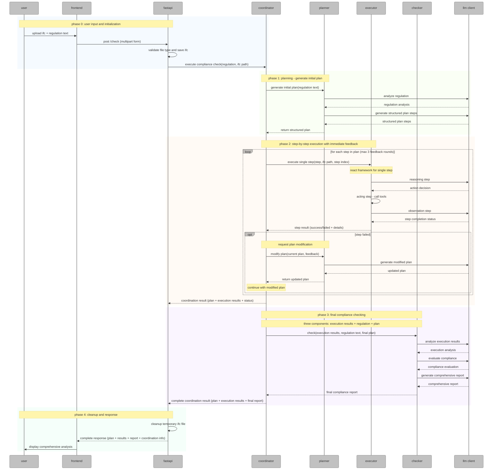

```mermaid
%%{init: {'theme':'base', 'themeVariables': {'primaryColor':'#66666667', 'fontSize':'18px', 'fontFamily':'Arial', 'primaryTextColor':'#333333', 'primaryBorderColor':'#666666', 'lineColor':'#666666', 'sectionBkgColor':'#ffffff', 'altSectionBkgColor':'#f8f8f8', 'gridColor':'#e0e0e0', 'activationBkgColor':'#ffffff', 'activationBorderColor':'#dddddd'}}}%%

sequenceDiagram
    participant U as user
    participant F as frontend
    participant API as fastapi
    participant C as coordinator
    participant P as planner
    participant E as executor  
    participant CH as checker
    participant LLM as llm client

    rect rgb(245, 250, 255)
        Note over U, API: phase 0: user input and initialization
        U->>F: upload ifc + regulation text
        F->>API: post /check (multipart form)
        API->>API: validate file type and save ifc
        API->>C: execute compliance check(regulation, ifc path)
    end

    rect rgb(250, 255, 245)  
        Note over C, P: phase 1: planning - generate initial plan
        C->>P: generate initial plan(regulation text)
        P->>LLM: analyze regulation
        LLM-->>P: regulation analysis
        P->>LLM: generate structured plan steps
        LLM-->>P: structured plan steps
        P-->>C: return structured plan
    end

    rect rgb(255, 250, 245)
        Note over C, E: phase 2: step-by-step execution with immediate feedback
        
        loop for each step in plan (max 3 feedback rounds)
            C->>E: execute single step(step, ifc path, step index)
            
            Note over E: react framework for single step
            E->>LLM: reasoning step
            LLM-->>E: action decision
            E->>E: acting step - call tools
            E->>LLM: observation step
            LLM-->>E: step completion status
            
            E-->>C: step result (success/failed + details)
            
            opt step failed
                Note over C, P: request plan modification
                C->>P: modify plan(current plan, feedback)
                P->>LLM: generate modified plan
                LLM-->>P: updated plan
                P-->>C: return updated plan
                Note over C: continue with modified plan
            end
        end
        
        C-->>API: coordination result (plan + execution results + status)
    end

    rect rgb(250, 245, 255)
        Note over C, CH: phase 3: final compliance checking
        Note over C, CH: three components: execution results + regulation + plan
        C->>CH: check(execution results, regulation text, final plan)
        CH->>LLM: analyze execution results
        LLM-->>CH: execution analysis
        CH->>LLM: evaluate compliance
        LLM-->>CH: compliance evaluation
        CH->>LLM: generate comprehensive report
        LLM-->>CH: comprehensive report
        CH-->>C: final compliance report
        
        C-->>API: complete coordination result (plan + execution results + final report)
    end

    rect rgb(245, 255, 250)
        Note over API, U: phase 4: cleanup and response
        API->>API: cleanup temporary ifc file
        API-->>F: complete response (plan + results + report + coordination info)
        F->>U: display comprehensive analysis
    end
```