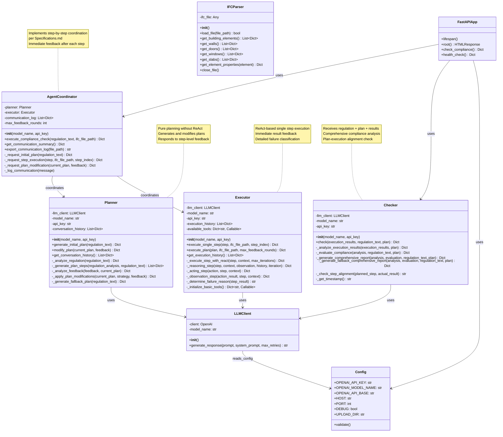

# Building Code Compliance Check System - UML Architecture (Step-by-Step Coordination)

## Class Diagram



## System Flow Diagram (Step-by-Step per Specifications.md)

```mermaid
sequenceDiagram
    participant User
    participant Frontend  
    participant FastAPI
    participant Coordinator
    participant Planner
    participant Executor
    participant Checker
    participant LLMClient

    %% Initial Request
    User->>Frontend: Upload IFC + Regulation Text
    Frontend->>FastAPI: POST /check
    FastAPI->>FastAPI: Save uploaded IFC file
    
    %% Planning Phase
    FastAPI->>Coordinator: execute_compliance_check()
    
    Note over Coordinator, Planner: Planning Phase: Coordinator sends regulation text to Planner
    Coordinator->>Planner: Request initial plan (JSON)
    Planner->>LLMClient: generate_response() [analyze regulation]
    LLMClient-->>Planner: regulation_analysis
    Planner->>LLMClient: generate_response() [generate plan steps]
    LLMClient-->>Planner: structured_plan_steps
    Planner-->>Coordinator: Structured plan (JSON)
    
    %% Execution Phase - Step by Step
    Note over Coordinator, Executor: Execution Phase: Step-by-step execution with immediate feedback
    
    loop For Each Step in Plan
        Coordinator->>Executor: execute_single_step() (JSON)
        
        %% ReAct execution for single step
        loop ReAct Iterations (max 3)
            Executor->>Executor: ReAct Reasoning
            Executor->>LLMClient: reasoning_step()
            LLMClient-->>Executor: action_decision
            
            Executor->>Executor: ReAct Acting
            Note over Executor: Use tools, validate, measure, etc.
            
            Executor->>Executor: ReAct Observation
            Executor->>LLMClient: observation_step()
            LLMClient-->>Executor: step_completion_status
            
            alt Step Completed
                break ReAct loop
            end
        end
        
        Executor-->>Coordinator: Step result + details (JSON)
        
        alt Step Success
            Note over Coordinator: Step completed successfully
        else Step Failed
            Note over Coordinator, Planner: Exception Handling: Request plan modification
            Coordinator->>Planner: Request plan modification (JSON)
            Planner->>LLMClient: modify_plan()
            LLMClient-->>Planner: modified_plan
            Planner-->>Coordinator: Updated plan (JSON)
            Note over Coordinator: Continue with modified plan
        end
    end
    
    Coordinator-->>FastAPI: Complete execution results
    
    %% Checking Phase - Three Components
    Note over FastAPI, Checker: Checking Phase: Send regulation text + plan + execution results
    FastAPI->>Checker: check(execution_results, regulation_text, final_plan)
    Checker->>LLMClient: generate_response() [analyze execution results]
    LLMClient-->>Checker: execution_analysis
    Checker->>LLMClient: generate_response() [evaluate compliance]
    LLMClient-->>Checker: compliance_evaluation
    Checker->>Checker: generate_comprehensive_report()
    Checker-->>FastAPI: Comprehensive compliance report
    
    %% Response to User
    FastAPI->>FastAPI: Cleanup temporary files
    FastAPI-->>Frontend: Results + coordination info + comprehensive report
    Frontend->>User: Display Complete Analysis
```

## Component Architecture (Updated)

```mermaid
graph TB
    %% Presentation Layer
    subgraph "Presentation Layer"
        UI[Web Frontend<br/>Enhanced Result Display<br/>Step-by-Step Progress]
        API[FastAPI REST API<br/>Single /check Endpoint<br/>Step-by-Step Integration]
    end
    
    %% Coordination Layer (Core Innovation)
    subgraph "Step-by-Step Coordination Layer"
        COORD[Agent Coordinator<br/>Per Specifications.md<br/>Immediate Step Feedback<br/>Dynamic Plan Modification]
    end
    
    %% Business Logic Layer
    subgraph "Business Logic Layer"
        subgraph "Planning Agent"
            PL[Planner Agent<br/>Regulation Analysis<br/>Plan Generation<br/>Plan Modification<br/>No ReAct Framework]
        end
        
        subgraph "Execution Agent"
            EX[Executor Agent<br/>Single Step Execution<br/>ReAct Framework<br/>Immediate Feedback<br/>Failure Classification]
        end
        
        subgraph "Evaluation Agent"
            CH[Checker Agent<br/>Three-Component Analysis<br/>Regulation + Plan + Results<br/>Comprehensive Reporting]
        end
        
        subgraph "Core Services"
            LLC[LLM Client<br/>OpenAI Integration<br/>Retry Logic]
        end
    end
    
    %% Data Layer
    subgraph "Data Layer"
        subgraph "File System"
            TEMP[Temporary Files<br/>IFC Uploads<br/>Auto-cleanup]
            LOGS[Communication Logs<br/>Step-by-Step Messages<br/>Feedback History]
        end
        
        subgraph "External APIs"
            OPENAI[OpenAI API<br/>LLM Services<br/>Custom Base URL]
        end
    end
    
    %% Utility Layer
    subgraph "Utility Layer"
        IFC[IFC Parser<br/>Building Model Processing<br/>(Available for tools)]
        CFG[Configuration<br/>Environment Settings<br/>Validation]
    end
    
    %% Connections
    UI --> API
    API --> COORD
    API --> CH
    
    COORD --> PL
    COORD --> EX
    COORD --> LOGS
    
    PL --> LLC
    EX --> LLC
    CH --> LLC
    
    LLC --> OPENAI
    API --> TEMP
    API --> CFG
    EX --> IFC
    
    %% Styling
    classDef agent fill:#e1f5fe
    classDef coordination fill:#fff3e0
    classDef service fill:#f3e5f5
    classDef data fill:#e8f5e8
    classDef util fill:#fff8e1
    
    class PL,EX,CH agent
    class COORD coordination
    class LLC service
    class TEMP,LOGS,OPENAI data
    class IFC,CFG util
```

## Step-by-Step Workflow per Specifications.md

### Phase 1: 规划阶段 (Planning Phase)
```
Coordinator → Planner: 发送法规文本
Planner 调用 LLM 分析法规，生成结构化的任务计划
Planner → Coordinator: 返回结构化计划
```

### Phase 2: 执行阶段 (Execution Phase)
```
Coordinator → Executor: 发送结构化计划和 IFC 文件
Executor 使用 ReAct 框架，逐步执行计划中的每一项任务：
    每完成一步：Executor → Coordinator: 反馈执行结果
    若某一步出现异常、数据缺失或任务失败：
        Coordinator → Planner: 发送反馈，请求重新规划
        Planner 基于反馈信息生成新的计划
        Planner → Coordinator: 返回更新后的计划
        Coordinator → Executor: 继续执行新计划
```

### Phase 3: 检查阶段 (Checking Phase)
```
Coordinator → Checker: 统一发送以下内容：
    - 原始法规文本
    - 执行过程中所使用的计划（可为更新后的版本）
    - 所有执行结果（结构化记录）
Checker 调用 LLM 判断执行结果是否符合规定
Checker → Coordinator: 返回检查结论与建议
```

## JSON Communication Protocol (Enhanced)

### Message Types
1. **plan_request/plan_response**: Planning phase communication
2. **step_execution_request/step_execution_response**: Single step execution communication (NEW)
3. **modification_request/modification_response**: Plan modification communication

### Step Execution Message Format
```json
{
  "message_type": "step_execution_request",
  "timestamp": "2024-01-01 12:00:00",
  "sender": "coordinator",
  "recipient": "executor",
  "payload": {
    "step": {
      "step_id": "step_1",
      "description": "Check evacuation stairway width",
      "task_type": "measurement",
      "required_tools": ["width_checker"],
      "expected_output": "Stairway width measurement result"
    },
    "ifc_file_path": "/path/to/file.ifc",
    "step_index": 0,
    "request_type": "execute_single_step"
  }
}
```

### Step Response Format
```json
{
  "message_type": "step_execution_response",
  "timestamp": "2024-01-01 12:01:00",
  "sender": "executor",
  "recipient": "coordinator",
  "payload": {
    "step_result": {
      "step_status": "success|failed",
      "step_result": {
        "result": "pass|fail",
        "detail": "Specific check result details",
        "elements_checked": ["element1", "element2"],
        "issues": []
      },
      "failure_reason": "tool_failure|missing_information|unclear_objective",
      "execution_details": {
        "react_history": ["reasoning", "action", "observation"],
        "iterations_used": 2
      }
    },
    "step_index": 0,
    "status": "success"
  }
}
```

## Key Design Patterns (Step-by-Step Architecture)

### 1. **Step-by-Step Coordinator Pattern**
- **Immediate Feedback**: Complete each step and provide immediate feedback, no waiting for all steps
- **Dynamic Replanning**: Request plan modification immediately when failure occurs
- **State Management**: Track execution status and cumulative results for each step

### 2. **Three-Component Checker Pattern**
- **Regulation Analysis**: Analyze original regulation requirements
- **Plan Effectiveness**: Evaluate completeness and effectiveness of plans
- **Execution Alignment**: Check consistency between execution results and plans

### 3. **Enhanced ReAct Framework** (Executor only)
- **Single Step Focus**: Execute only one step at a time with higher concentration
- **Rich Feedback**: Provide detailed failure classification and execution context
- **Tool Integration**: Built-in multiple checking tools

### 4. **Adaptive Planning Pattern**
- **Context-Aware Modification**: Modify plans based on execution context
- **Failure-Driven Replanning**: Different failure types trigger different modification strategies
- **History Preservation**: Maintain plan modification history and reasons

## Agent Responsibilities (Final Version)

### 🎯 Planner Agent
- ✅ Parse regulation text into structured requirements
- ✅ Generate initial execution plans with detailed steps
- ✅ Modify plans based on step-level Executor feedback
- ✅ Maintain detailed conversation history
- ❌ No direct tool execution or ReAct framework usage

### ⚡ Executor Agent  
- ✅ Execute single steps using ReAct framework
- ✅ Provide immediate feedback after each step completion
- ✅ Generate detailed failure analysis with classification
- ✅ Handle tool execution and validation
- ✅ Rich execution context for debugging

### 📊 Checker Agent
- ✅ Receive and analyze three components: regulation + plan + results
- ✅ Evaluate plan-execution alignment
- ✅ Generate comprehensive compliance reports
- ✅ Provide improvement recommendations
- ✅ Track plan effectiveness and modifications

### 🎮 Agent Coordinator
- ✅ Implement step-by-step coordination per Specifications.md
- ✅ Manage immediate feedback loops between agents
- ✅ Handle dynamic plan modifications
- ✅ Log all communications with detailed context
- ✅ Provide execution progress tracking

## Performance Characteristics

- **Responsiveness**: Immediate feedback after each step
- **Adaptability**: Dynamic plan modification during execution
- **Traceability**: Complete communication and execution logs
- **Reliability**: Multiple fallback mechanisms and error handling
- **Scalability**: Modular agent design with clear interfaces

## Technology Stack

- **Web Framework**: FastAPI with step-by-step progress tracking
- **AI/ML**: OpenAI API integration with comprehensive prompting
- **Agent Architecture**: Step-by-step coordination with immediate feedback
- **Communication**: Enhanced JSON protocol with rich context
- **Execution**: ReAct framework optimized for single-step focus
- **Analysis**: Three-component comprehensive evaluation system
- **Logging**: Detailed communication and execution history