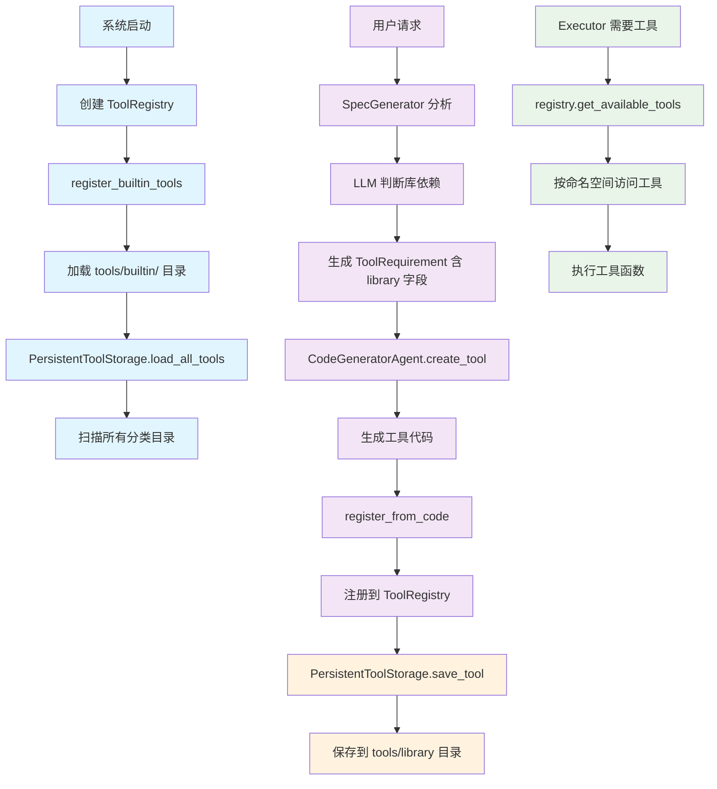
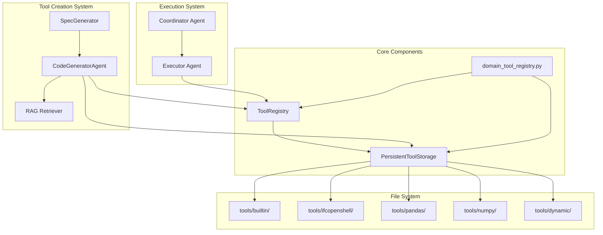
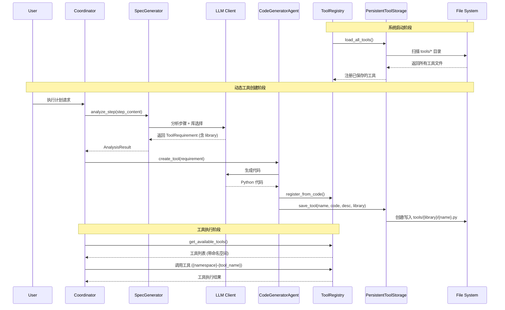
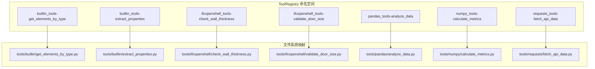

# 工具注册检索加载流程图

## 整体架构流程

## 详细组件关系图

## 数据流详细图

## 工具命名空间组织

## 关键改进点

### 🔄 **动态分类系统**
- **之前**: 固定分类列表 + 关键词匹配
- **现在**: LLM 智能判断 + 动态目录创建

### 📚 **库依赖管理**
- **ToolRequirement.library**: 明确指定主要库
- **自动目录创建**: tools/{library}/ 按需创建
- **命名空间**: {library}_tools-{function_name}

### 🔍 **工具检索**
- **启动时**: 扫描所有现有目录
- **运行时**: 通过 ToolRegistry 统一访问
- **命名空间**: 防止工具名称冲突

### 💾 **持久化策略**
- **分类存储**: 按库分目录存放
- **元数据跟踪**: metadata.json 记录所有工具信息
- **动态加载**: 支持新增库目录

这个流程确保了工具的智能分类、持久化存储和高效检索！